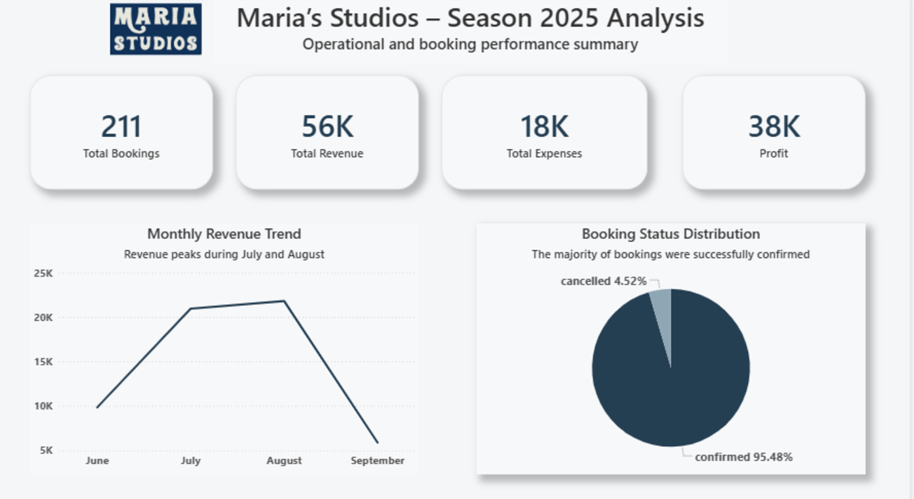
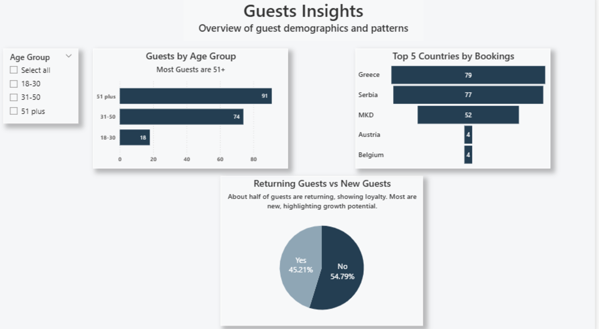
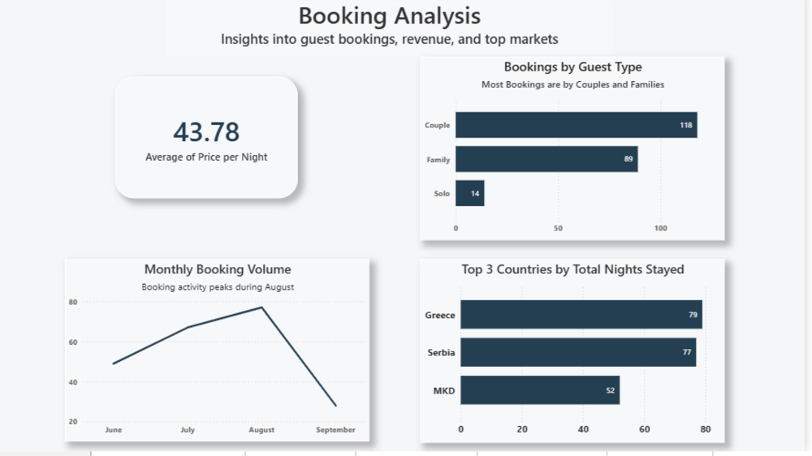
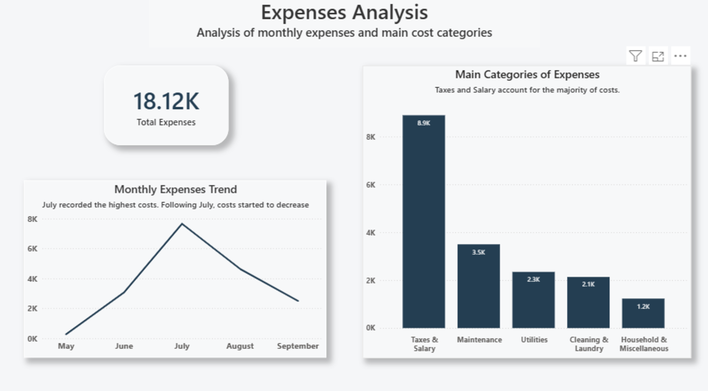
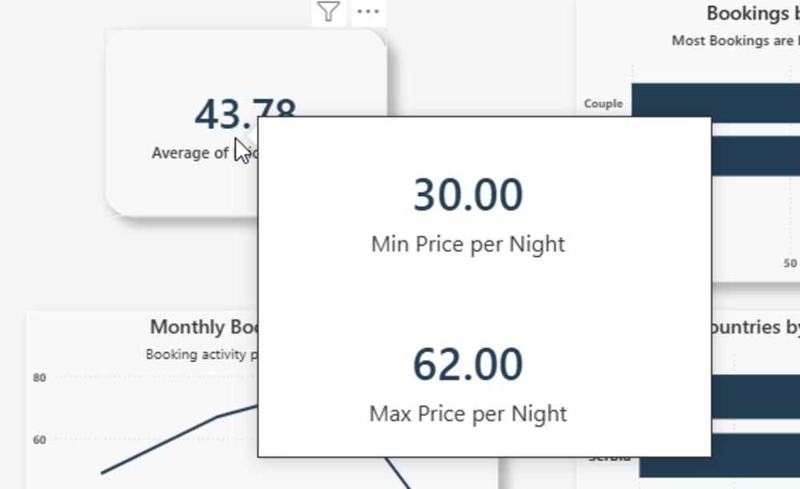
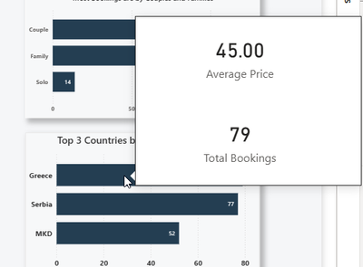

# Maria Studios Season 2025 Analysis  

This project analyzes all guest reservations, guest details, revenues, and expenses for **Maria Studios** during the summer season 2025.  
It was created as a **junior data analyst portfolio project**, combining **Excel** and **Power BI** to practice real-world data analysis skills. The dataset was created from scratch while  managing the family-owned business, providing valuable insights into the business performance.

---

## What's Included  

- **Dataset**: Custom **Excel dataset** built from scratch based on real rental-room data, including **Guests**, **Bookings**, and **Expenses** sheets.  
- **Power BI Dashboard**: Interactive dashboards visualizing bookings, revenue, guest demographics, and expenses trends.  
- **Excel Analysis**: Data cleaning, transformation, and advanced formulas ( VLOOKUP, IFS).  

---

## Skills Practised  

- **Data Cleaning**: Removal of duplicates, data validation,trimming unnecessary spaces, and converting data types (e.g., dates, numbers).
- **Data Transformation**: Sorting, filtering, and advanced formulas (VLOOKUP, IFS)  
- **Data Analysis**: Calculation of key metrics like **average price per night**, **total revenue**, and **profit**  
- **Data Visualization**: Dashboards and interactive charts in Power BI, including slicers, line charts, bar charts, funnels, and cards  
- **Data Modeling**: Creating relationships between tables and calculated columns in Power BI  

---

## Power BI Dashboard Overview  

The dashboard consists of **four pages**:

1. **Executive Overview** – Key metrics like total revenue, bookings, profit, plus **revenue and booking status trends**.  
  
2. **Guest Insights** – Insights into **age groups**, **returning vs new guests**, and **guest booking distribution by country**.  
  
3. **Booking Analysis** – Insights into **bookings by guest type**, **top countries**, **nights stayed**, and **average price per night**.  
  
4. **Expenses Overview** – Breakdown of **monthly expenses**,  **key cost categories** (e.g., taxes, salary, maintenance), and trends over time.  
  

**Highlights**:  
- Interactive slicers (e.g., by age group)  
- Tooltips on charts showing additional metrics (average price, count of bookings, min/max values)
  
---

## Key Insights  

- **Guest Demographics**: The majority of new guests are **young adults** (18-30 age group), with a growing trend of **returning guests** indicating strong customer loyalty.  
- **Revenue Trends**: **August** recorded the highest revenue, followed by a gradual decrease through the end of the season.  
- **Booking Analysis**: **Most bookings** were confirmed, with **couples** and **families** being the predominant guest types.  
- **Expense Insights**: **Taxes, salaries, and maintenance** are the highest cost categories, with a peak in **July**.

---

## Tooltips  

In the **Power BI Dashboard**, the following charts include **tooltips** for deeper insights:

- **Booking Analysis (Top 3 Countries by Total Nights Stayed)**: Provides insights into the **top 3 countries** with additional information on **average price per night** and **booking count**.  
- **Booking Analysis (Average Price per Night)**: Shows the **minimum and maximum price per night** in the tooltip.

   

---

## Future Improvements  

- Create a **Date Table** to unify month analysis across **Bookings** and **Expenses** for better time intelligence.  
- Enhance **Power BI tooltips** with more actionable insights and additional visualizations.  
- Consider adding **map charts** or **heatmaps** for geographical analysis of guest origins.  

